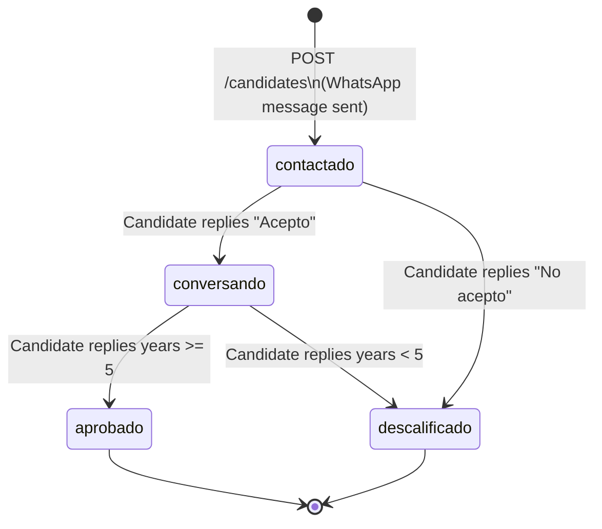

# QA Automation Senior — Technical Test

## Overview

This project simulates a **Talent Acquisition Platform**. Recruiters create job vacancies and add candidates. When a candidate is added, the platform contacts them via **WhatsApp** (using Baileys) and drives a conversational flow to qualify them.

Your task is to build a complete QA automation suite using **Playwright** as the UI testing framework and **Cucumber** for scenario definition, plus **Baileys** to simulate the candidate's WhatsApp side during tests.

---

## System Architecture

```
Frontend  (React + Vite)   →  http://localhost:5173
Backend   (Node + Express) →  http://localhost:3000
WhatsApp  (Baileys)        →  real WhatsApp account (QR scan on backend start)
```

---

## Candidate State Machine



### Conversation steps

| Stage | Trigger | Action |
|---|---|---|
| `awaiting_acceptance` | Candidate created | Send button message: "¿Quieres iniciar el proceso?" with buttons **Acepto** / **No acepto** |
| `awaiting_experience` | Candidate replies "Acepto" | Status → `conversando`. Send vacancy description + ask for years of experience |
| `done` | Candidate replies years ≥ 5 | Status → `aprobado` |
| `done` | Candidate replies years < 5 | Status → `descalificado` |
| `done` | Candidate replies "No acepto" | Status → `descalificado` |

> **Note on buttons:** WhatsApp `buttonsMessage` may render as plain text on some non-Business accounts. The backend always includes a text fallback in the message body. Your automation must handle both button responses and plain text responses (the backend accepts both).

---

## REST API Reference

Base URL: `http://localhost:3000/api`

### Vacancies

| Method | Path | Body | Description |
|---|---|---|---|
| `GET` | `/vacancies` | — | List all vacancies |
| `POST` | `/vacancies` | `{ name, area, location, description }` | Create a vacancy |

**Example response (GET /vacancies):**
```json
[
  {
    "id": "v-001",
    "name": "QA Automation Engineer",
    "area": "Engineering",
    "location": "Mexico City, MX",
    "description": "...",
    "createdAt": "2026-05-01T10:00:00.000Z"
  }
]
```

### Candidates

| Method | Path | Body | Description |
|---|---|---|---|
| `GET` | `/vacancies/:id/candidates` | — | List candidates for a vacancy |
| `POST` | `/vacancies/:id/candidates` | `{ name, lastName, phone, email }` | Create candidate + trigger WhatsApp message |

**Example response (POST /vacancies/:id/candidates):**
```json
{
  "id": "c-abc12345",
  "vacancyId": "v-001",
  "name": "Juan",
  "lastName": "Pérez",
  "phone": "5215512345678",
  "email": "juan@example.com",
  "status": "contactado",
  "conversationStage": "awaiting_acceptance",
  "createdAt": "2026-05-08T12:00:00.000Z"
}
```

**Candidate status values:** `contactado` | `conversando` | `aprobado` | `descalificado`

---

## Frontend `data-testid` Reference

| Selector | Element |
|---|---|
| `[data-testid="vacancies-table"]` | Vacancies table |
| `[data-testid="vacancy-row-{id}"]` | Table row for a specific vacancy |
| `[data-testid="btn-create-vacancy"]` | "New Vacancy" button (header) |
| `[data-testid="btn-view-candidates-{id}"]` | "View Candidates" button for a vacancy |
| `[data-testid="btn-add-candidate-{id}"]` | "Add Candidate" button for a vacancy |
| `[data-testid="input-vacancy-name"]` | Vacancy name input |
| `[data-testid="input-vacancy-area"]` | Vacancy recruiting area input |
| `[data-testid="input-vacancy-location"]` | Vacancy location input |
| `[data-testid="input-vacancy-description"]` | Vacancy description textarea |
| `[data-testid="btn-submit-vacancy"]` | Submit button in vacancy form |
| `[data-testid="candidates-table"]` | Candidates table |
| `[data-testid="candidate-row-{id}"]` | Table row for a specific candidate |
| `[data-testid="candidate-status-{id}"]` | Status badge for a specific candidate |
| `[data-testid="btn-refresh-candidates"]` | Refresh button on candidates page |
| `[data-testid="input-candidate-name"]` | Candidate first name input |
| `[data-testid="input-candidate-lastname"]` | Candidate last name input |
| `[data-testid="input-candidate-phone"]` | Candidate WhatsApp number input |
| `[data-testid="input-candidate-email"]` | Candidate email input |
| `[data-testid="btn-submit-candidate"]` | Submit button in candidate form |
| `[data-testid="btn-cancel"]` | Cancel button in any modal |

---

## Setting Up Two WhatsApp Sessions

The automation requires **two separate WhatsApp accounts**:

1. **Server session** — already managed by the backend. When you run `node src/index.js`, a QR code appears in the terminal. Scan it with WhatsApp account #1. The session is saved in `backend/baileys-session/` and reused on restart.

2. **Candidate simulator session** — a second Baileys instance that you control from your test code to send messages *as* the candidate (WhatsApp account #2).

### Setting up the candidate simulator session

```js
// automation/support/candidateWhatsApp.js
const { Client, LocalAuth } = require('whatsapp-web.js');
const qrcode = require('qrcode-terminal');
const path = require('path');

const SESSION_DIR = path.resolve('./candidate-session');
let client = null;

async function connectCandidateWA() {
  return new Promise((resolve, reject) => {
    client = new Client({
      authStrategy: new LocalAuth({ dataPath: SESSION_DIR }),
      puppeteer: {
        headless: true,
        args: ['--no-sandbox', '--disable-setuid-sandbox'],
      },
    });

    client.on('qr', (qr) => {
      console.log('\n[Candidate WA] Scan this QR with WhatsApp account #2:\n');
      qrcode.generate(qr, { small: true });
    });

    client.on('ready', () => {
      console.log('[Candidate WA] Connected ✓');
      resolve(client);
    });

    client.on('auth_failure', (msg) => reject(new Error(`Auth failure: ${msg}`)));

    client.initialize();
  });
}

/**
 * Send a message from the candidate (account #2) to the server (account #1).
 * @param {string} serverPhone - Phone number of WhatsApp account #1 (the backend)
 * @param {string} text - Message text
 */
async function sendAsCandidate(serverPhone, text) {
  const chatId = `${serverPhone.replace(/\D/g, '')}@c.us`;
  await client.sendMessage(chatId, text);
}

async function disconnectCandidateWA() {
  await client?.destroy();
}

module.exports = { connectCandidateWA, sendAsCandidate, disconnectCandidateWA };
```

### First-time setup

Run the following once to scan the QR for the candidate session:

```bash
cd automation
node -e "require('./support/candidateWhatsApp').connectCandidateWA()"
```

A QR code will print in the terminal. Scan it with WhatsApp account #2. The session is saved in `automation/candidate-session/` for future runs.

### Phone number requirements

| Session | Account | Purpose |
|---|---|---|
| `backend/.wwebjs_auth/` | WhatsApp #1 | Receives and sends messages as the platform |
| `automation/candidate-session/` | WhatsApp #2 | Sends messages as the candidate in tests |

> **Tip:** WhatsApp Web (web.whatsapp.com) and the whatsapp-web.js session cannot be active simultaneously on the same number. Use the wwebjs session for the server; use the mobile app normally for your personal number. If the session gets stuck, delete `backend/.wwebjs_auth/` and restart to re-scan QR.

---

## Your Tasks

### 1. Install dependencies

```bash
cd automation
npm init -y
npm install -D @playwright/test @cucumber/cucumber @cucumber/html-formatter
npm install whatsapp-web.js qrcode-terminal
npx playwright install chromium
```

### 2. Project structure (suggested)

```
automation/
├── features/
│   ├── smoke/
│   │   └── vacancies.feature
│   │   └── candidates.feature
│   └── regression/
│       └── whatsapp-flow.feature
├── steps/
│   ├── vacancySteps.js
│   ├── candidateSteps.js
│   └── whatsappSteps.js
├── support/
│   ├── world.js           (Cucumber World with Playwright browser)
│   ├── hooks.js           (Before/After hooks)
│   └── candidateWhatsApp.js
├── candidate-session/     (gitignore this — stores WhatsApp #2 session)
├── cucumber.json
└── package.json
```

### 3. Cucumber configuration

```json
// cucumber.json
{
  "default": {
    "paths": ["features/**/*.feature"],
    "require": ["steps/**/*.js", "support/**/*.js"],
    "format": ["progress", "html:reports/report.html"]
  }
}
```

### 4. Write Gherkin scenarios

You must write `.feature` files for the following scenarios:

#### Smoke Tests — Happy path

- Create a new vacancy and verify it appears in the vacancies table
- Add a candidate to a vacancy and verify their status is `contactado` in the UI

#### Regression Tests

- **Accept flow:** Candidate receives WhatsApp message → replies "Acepto" → status changes to `conversando` → replies with 6 years → status changes to `aprobado`
- **Reject flow:** Candidate receives WhatsApp message → replies "No acepto" → status changes to `descalificado`
- **Disqualified by experience:** Candidate replies "Acepto" → replies with 3 years → status changes to `descalificado`
- **Invalid experience input:** Candidate replies "Acepto" → replies with non-numeric text → bot asks again → candidate replies with valid number

### 5. WhatsApp automation notes

- Use `candidateWhatsApp.js` to send messages as the candidate.
- After sending a WhatsApp message in a step, poll or wait for the backend to process it before calling `GET /candidates` or refreshing the UI. A short `waitForTimeout` or retry loop is acceptable.
- Make sure both sessions are connected before running the WhatsApp regression tests.
- Prefer `page.waitForSelector` over fixed timeouts wherever possible.

---

## Running Everything

```bash
# Terminal 1 — Backend
cd backend
cp .env.example .env
npm install
node src/index.js
# Scan QR with WhatsApp account #1

# Terminal 2 — Frontend
cd frontend
npm install
npm run dev

# Terminal 3 — Automation (after both sessions are paired)
cd automation
npx cucumber-js
```

---

## Evaluation Criteria

| Area | What we look at |
|---|---|
| **Scenario design** | Coverage, clarity of Gherkin, use of Background/Scenario Outline |
| **Step definitions** | Reusability, clean use of Playwright locators (prefer `data-testid`) |
| **WhatsApp automation** | Correct use of Baileys to simulate candidate responses |
| **Reliability** | No flaky tests; proper waits and assertions |
| **Reporting** | HTML report generated, test names meaningful |
| **Code quality** | Clean, readable, no duplication |

Good luck! 🚀
